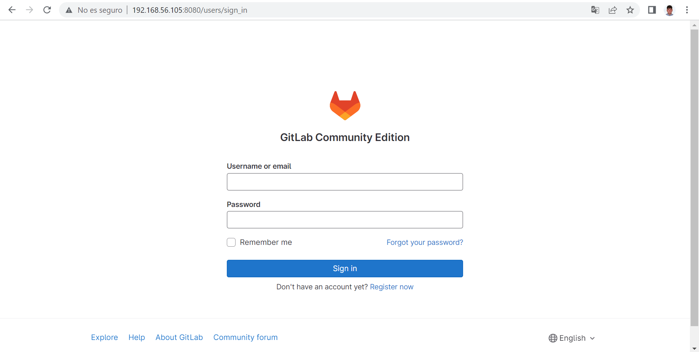

# cvs-git

1. Montar un servidor cvs (se puede usar docker)
2. Investigar como crear un repositorio cvs, tras ello crearlo
3. Darle contenido ha dicho repositorio (se recomiendan hacer commits)
4. Investigar como funciona la herramienta cvs-fast-export
5. Instalarse cvs-fast-export (no vale con apt install pues la versión de los repositorios es antigua. Se recomienda descargarse el codigo del repositorio oficial y compilarlo)
6. Instalar gitlab en docker (edición ce). Se recomienda usar docker-compose.
7. Migrar el repositorio de cvs a git
8. Automatizar el séptimo paso con un script de python. Al lanzar este script se debe crear un repositorio en el gitlab y subir el repositorio migrado. Los parámetros de este script pueden ser los que queráis.
9. Documentación del proceso.

## 1. Montar un servidor cvs 

Para montarlo simplemente instalamos el paquete CVS en el servidor. Para ello, ejecutamos el siguiente comando:

```bash
sudo apt install cvs
```

## 2 & 3. Crear un repositorio cvs y darle contenido

Vamos a instalarlo sobre la máquina directamente. Para ello, seguimos los pasos explicados en el siguiente enlace: [https://www.linuxfromscratch.org/blfs/view/5.1/server/cvsserver.html](https://www.linuxfromscratch.org/blfs/view/5.1/server/cvsserver.html)

1. Creamos un repositorio

```bash
mkdir /home/USUARIO/cvsroot &&
chmod 1777 /home/USUARIO/cvsroot &&
export CVSROOT=/home/USUARIO/cvsroot &&
cvs init
```

2. Importar contenido al repositorio 

```bash
export CVSROOT=/home/USUARIO/cvsroot &&
cd [directorio del proyecto] &&
cvs import -m "Commit inicial" [nombre del módulo] [nombre del vendedor] [nombre de la rama]
cvs checkout [nombre del módulo]
cd [nombre del módulo]
```

tras eso, se habrá creado un directorio con el nombre [nombre del módulo] Es en este directorio donde se encuentra el contenido del módulo, y donde se realizarán los commits.

3. verificar el acceso a los repositorios locales

```bash
$ cvs co [nombre del proyecto]
cvs checkout: Updating cvstest
U cvstest/codigo.py
U cvstest/index.html
cvs checkout: Updating cvstest/CVSROOT
U cvstest/CVSROOT/checkoutlist
U cvstest/CVSROOT/commitinfo
U cvstest/CVSROOT/config
U cvstest/CVSROOT/cvswrappers
U cvstest/CVSROOT/loginfo
U cvstest/CVSROOT/modules
U cvstest/CVSROOT/notify
U cvstest/CVSROOT/postadmin
U cvstest/CVSROOT/postproxy
U cvstest/CVSROOT/posttag
U cvstest/CVSROOT/postwatch
U cvstest/CVSROOT/preproxy
U cvstest/CVSROOT/rcsinfo
U cvstest/CVSROOT/taginfo
U cvstest/CVSROOT/verifymsg
```

# 4 & 5. Investigar como funciona la herramienta cvs-fast-export e instalarla

**cvs-fast-export**,  [https://gitlab.com/esr/cvs-fast-export](https://gitlab.com/esr/cvs-fast-export) es una herramienta que analiza una colección de ficheros RCS en un repositorio CVS y, si es posible, devuelve un histórico equivalente en el formato de un flujo fast-import. 

Para utilizarlo, se siguen los siguientes pasos:

1. Instalar cvs-fast-export

```bash
git clone https://gitlab.com/esr/cvs-fast-export
cd cvs-fast-export
sudo install cvs-fast-export /usr/local/bin/cvs-fast-export
```

2. Ejecutar cvs-fast-export: Nos posicionamos en el CVSROOT, y ejecutamos el siguiente comando:

```bash
find . | cvs-fast-export > stream.fi 
```

## 6. Instalar gitlab en docker

Sigo los siguientes pasos:

1. Instalar docker y docker-compose

```bash
sudo apt install docker.io docker-compose
```

2. Ejecuto docker-compose utilizando el siguiente archivo [docker-compose.yaml](docker-compose.yaml)

```bash
docker-compose up -d
```

3. Tras unos minutos, obtengo la contraseña de la siguiente manera (el usuario es root):

```bash
sudo docker exec -it gitlab-ce cat /etc/gitlab/initial_root_password
```

4. Accedo a la interfaz web de gitlab en la dirección [http://localhost:8080](http://localhost:8080) con las credenciales obtenidas y, creo un nuevo usuario.



## 7. Migrar el repositorio de cvs a git

1. Al usuario previamente creado, le creo un token de acceso en la sección de configuración de la cuenta, o en mi caso, le añado la clave ssh pública de la máquina con el repositorio CVS.
2. Creo un nuevo repositorio vacío, con visibilidad pública o privada, sin README.
3. añado el repositorio remoto a mi repositorio local de git, y hago un push de todo el contenido usando los siguientes comandos (en la carpeta del repositorio)
```bash
git remote rename origin old-origin
git remote add origin ssh://git@localhost:8022/[USUARIO]/[REPOSITORIO].git
git push -u origin --all
git push -u origin --tags
```
Se especifica el puerto 8022 porque en la configuración de gitlab, he puesto ese puerto para ssh, ya que en la máquina anfitriona ya se encontraba en uso el puerto.

## 8. Automatizar el séptimo paso con un script de python
